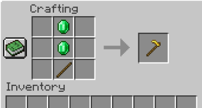
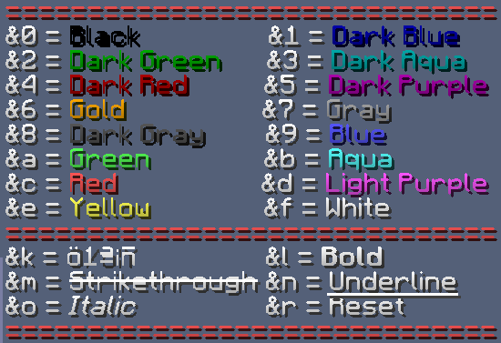

## Item Serializer
```yaml
Item:
  Type: <Material>:<Data>
  Name: <name>
  Lore:
  - <Lore line>
  - <etc.>
  Durability: <durability>
  Unbreakable: <true/false>
  Custom_Model_Data: <custom model data number>
  Hide_Flags: <true/false>
  Enchantments:
  - <Enchantment>-<Level>
  Skull:
    Owning_Player: <UUID of player or name of player>
  Potion:
    Color: <ColorType>
  Attributes:
  - <Attribute>-<Amount>
  Leather_Color: <me.deecaad.core.file.serializer.ColorSerializer>
  Recipe:
    Shape:
      - "012"
      - "345"
      - "678"
    Ingredients:
      '0': <ItemSerializer>
      '1': <ItemSerializer>
```
#### `Type`: \<String\>
This is the material of your item, e.g. `diamond_hoe`. This is not case-sensitive. **NEVER USE MAGIC NUMBERS**.
This plugin does not support numerical item ids. Instead of using 294, you **must** use `golden_hoe`.

If you are in legacy versions (minecraft versions 1.8.9 through 1.12.2) then you may have to use extra data.
If you want to use red dye as your item, you should use: `Type: dye:1`.

For material lists for each version, please look [here](References.md).

#### `Name`: \<String\>
This is the display name for your item, like renaming your item in an anvil. You can use [color codes](#color).

#### `Lore`: \<String List\>
This is the lore of your item. There can be as many lines as you want. You can use [color codes](#color).

#### `Durability`: \<Integer\> 
How damaged your item is. Make sure you only use this with things that can be damaged (bows, tools, swords, fishing rod).

#### `Unbreakable`: \<Boolean\>
Sets if your weapon is unbreakable by vanilla durability.

#### `Custom_Model_Data`: \<Integer\>
Sets the [custom model data](https://www.planetminecraft.com/forums/communities/texturing/new-1-14-custom-item-models-tuto-578834/)
introduced in minecraft 1.14.

#### `Hide_Flags`: \<Boolean\>
Hides all item flags (Enchantments, Attributes, Unbreakable, Destroys, Placed on, Potion effects, Dye color).

#### `Enchantments`: \<String List\>
Adds enchantments with given levels to the item. The format is `Enchant-Level`. For the complete list of
enchantments, please look [here](References.md#enchantments).

Example:
```yaml
Enchantments:
  - "sharpness-5"
  - "smite-5"
```

#### `Skull.Owning_Player`: \<String\>
Sets the skull data of the skull. Make sure to use `Type: player_skull` with this.

#### `Potion.Color`: \<String\>

#### `Attributes`: \<String List\>

#### `Leather_Color`: \<Color\>
See [color serializer](#Color).

#### `Recipe`: 
This creates a craft recipe for your item so you can craft it in a 
crafting table. You can only make recipes with shapes (So you have to
specify a shape, like an iron sword. You can not have a shapeless recipe,
like a flint and steel).

* `Shape`:
  * This is where you define where your items go.
  * Each item gets a unique character
  * You can have 3 items each line
* `Ingredients`:
  * These are the actual items that you put in the crafting table
  * You can use simple materials or advanced
  * Instead of explaining how to use this, just look at the examples
  
Examples: 

The following creates a recipe like an emerald sword
```yaml
  Recipe:
    Shape:
      - "e"
      - "e"
      - "s"
    Ingredients:
      'e': EMERALD
      's': STICK
```

```yaml
  Recipe:
    Shape:
      - "e e"
      - " # "
      - "e e"
    Ingredients:
      'e':
        Type: "diamond"
        Name: "&eTest"
        Lore:
          - "&7Testing testing 123"
      '#': STICK
```

## Message Color Codes

In minecraft versions under 1.16, you can use basic color codes by using the `&` symbol.


In minecraft versions 1.16 and higher, you can do the above, and have full HEX code support.
If you are not familiar with HEX, it's basically just a number format. Here we use hex to
store colors. You can use HEX format in config by using `&#<code>` where code is your 6 digit
hex code. You can use an [Online Color Picker](https://htmlcolorcodes.com/color-picker/) to
help find the hex code you want.

## Color Serializer

```yaml
Color: <String>
```
There are 3 valid formats for colors: `simple`, `rgb`, and `hex`. (Pick
whichever one you like the most. I prefer `hex`)

Colors using the `simple` format are like the vanilla minecraft chat
colors. Here is the predefined list:
* `"black"`
* `"dark_blue"`
* `"dark_green"`
* `"dark_aqua"`
* `"dark_red"`
* `"dark_purple"`
* `"gold"`
* `"gray"`
* `"dark_gray"`
* `"blue"`
* `"green"`
* `"aqua"`
* `"red"`
* `"light_purple"`
* `"yellow"`
* `"white"`


To use the `rgb` format, use `red-green-blue`. For example, purple could
look like this: `255-0-255`. Online color calculators should have support
for rgb.

For `hex`, use `#<code>`, where \<code\> is the 6 digit hex. [Online color
calculators] should have support for hex

Examples:
```yaml
Color: "red" # RED
```
```yaml
Color: "255-0-0" # RED 
```
```yaml
Color: "#FF0000" # Red
```

## Trigger
```yaml
  Trigger:
    Main_Hand: <TriggerType>
    Off_Hand: <TriggerType>
    Deny_When:
      Reloading: <true/false>
      Zooming: <true/false>
      Sneaking: <true/false>
      Standing: <true/false>
      Walking: <true/false>
      Swimming: <true/false>
      In_Midair: <true/false>
      Gliding: <true/false>
```
Triggers are actions that are used to call specific methods in code. For example,
in order for shooting to occur there has to be a shoot trigger.

Triggers:
* `"start_sneak"`
* `"end_sneak"`
* `"double_sneak"`
* `"start_sprint"`
* `"end_sprint"`
* `"right_click"`
* `"left_click"`
* `"drop_item"`
* `"jump"`
* `"double_jump"`
* `"start_swim"`
* `"end_swim"`
* `"start_glide"`
* `"end_glide"`
* `"swap_to_main_hand"`
* `"swap_to_off_hand"`
* `"start_walk"`
* `"end_walk"`
* `"start_in_midair"`
* `"end_in_midair"`
* `"start_stand"`
* `"end_stand"`

#### `Main_Hand`: \<String\>
This is what trigger the plugin will listen for when your gun is in your main
hand. 

Use one of the triggers from the list above.

#### `Off_hand`: \<String\>
This is what trigger the plugin will listen for when your gun is in your off
hand. 

Use one of the triggers from the list above.

#### `Deny_When`:
This is a list of things that can stop the plugin from triggering things. Say you
don't want people to be able to reload guns in water, you can do that here. If any
of these conditions are met, then the trigger does not occur.

* `Reloading`: \<Boolean\>
  * If the player is reloading.
* `Zooming`: \<Boolean\>
  * If the player is scoping.
* `Sneaking`: \<Boolean\>
  * If the player is sneaking (holding shift).
* `Standing`: \<Boolean\>
  * If the player isn't doing anything.
* `Walking`: \<Boolean\>
  * If the player is moving.
* `Swimming`: \<Boolean\>
  * If the player is in water.
* `In_Midair`: \<Boolean\>
  * If the player is not on the ground.
* `Gliding`: \<Boolean\>
  * If the player is gliding using an elytra.

## Mechanics
Mechanics are widely usable in WeaponMechanics. Using these you can play additional
effects during certain events.

```yaml
Mechanics:
  Message: <MessageSerializer>
  Sounds: <SoundsSerializer>
  Potion_Effects: <PotionEffectsSerializer>
  Firework: <FireworkSerializer>
  Movement: <MovementSerializer>
```

#### `Message`:
All messages support [placeholders](Placeholders.md).

```yaml
Message:
  Send_Globally: <true/false>
  Send_Globally_For_World: <true/false>
  Chat:
    Message: <message>
    Click: <ClickEvent.Action>-<value>
    Hover_Text: <message>
  Action_Bar:
    Message: <message>
    Time: <ticks>
  Title:
    Title: <title>
    Subtitle: <subtitle>
    Time: <fade in ticks>-<stay ticks>-<fade out ticks>
  Boss_Bar:
    Title: <title>
    Bar_Color: <BarColor>
    Bar_Style: <BarStyle>
    Time: <ticks>
```

#### `Send_Globally`: \<Boolean\>
True to send globally for all players in the server.

#### `Send_Globally_For_World`: \<Boolean\>
True to send for all players in the same world.

#### `Chat`:
This message is sent for the player in chat.

* `Message`: \<String\>
  * The message to send.
* `Click`: \<ClickEvent.Action\>-\<String\>
  * Add click event for chat message. The second string defines what value is given for click.
    * For example `Click: "SUGGEST_COMMAND-weaponmechanics help"` would suggest `weaponmechanics help` command.
  * Available click actions:
    * `OPEN_URL`
    * `OPEN_FILE`
    * `RUN_COMMAND`
    * `SUGGEST_COMMAND`
    * `COPY_TO_CLIPBOARD`
* `Hover_Text`: \<String\>
  * The text shown when hovering mouse over chat message.

#### `Action_Bar`:
This message is sent for player in action bar.
Action bar is the message box right above hotbar.

* `Message`: \<String\>
  * The message to send.
* `Time`: \<Integer\>
  * The time in ticks action bar message is shown.

#### `Title`:
These messages are sent to either title and/or subtitle
right into middle of the screen.

* `Title`: \<String\>
  * The message to send as title, this is shown bigger in player screen than subtitle.
* `Subtitle`: \<String\>
  * The message to send as subtitle.
* `Time`: \<Integer\>-\<Integer\>-\<Integer\>
  * Defines the fade in, stay and fade out time in ticks.
  * For example `Time: 5-20-5` would make the title and subtitle fade in for `5` ticks, 
    stay on screen for `20` ticks and then fade out for `5` ticks.

#### `Boss_Bar`:
These messages are sent to boss bar. They can stack over each other.
**This feature is only available in 1.9 and newer server versions!**

* `Title`: \<String\>
  * The boss bar message.
* `Bar_Color`: \<BarColor\>
  * Defines the boss bar color.
  * Available bar colors:
    * `PINK`
    * `BLUE`
    * `RED`
    * `GREEN`
    * `YELLOW`
    * `PURPLE`
    * `WHITE`
* `Bar_Style`: \<BarStyle\>
  * Defines the boss bar style.
  * Available bar styles:
    * `SOLID`
    * `SEGMENTED_6`
    * `SEGMENTED_10`
    * `SEGMENTED_12`
    * `SEGMENTED_20`
* `Time`: \<Integer\>
  * Defines the time in ticks boss bar is shown.

#### `Sounds`: \<String List\>
```yaml
Sounds:
- <sound>-<volume>-<pitch>,<etc.>
- <sound>-<volume>-<pitch>-<delay>-<pitchNoise>,<etc.>
- custom:<sound>-<volume>-<pitch>,<etc.>
- custom:<sound>-<volume>-<pitch>-<delay>-<pitchNoise>,<etc.>
- <etc.>
```

* `sound`: \<String\>
  * See list of available sounds [here](References.md#sounds)
  * To use a custom (resource pack) sound:
    * Find the name of the sound from your `sounds.json`.
    * Replace the \<sound\> argument with that name.
    * Add `custom:` before that sound.
* `volume`: \<Double\>
  * Defines how far this sound can be heard.
  * `1.0` is equal to `16` blocks. Meaning if volume is `2.0`, this sound can be heard withing `32` blocks.
  * Numbers smaller than `1.0` are still played within `16` blocks, but they are played quietly.
* `pitch`: \<Double\>
  * Defines how fast the sound is played.
  * Pitch has to be between `0.5` and `2.0`. `0.5` means sound is played in half speed 
    and `2.0` again means that sound is played in double speed.
* `delay`: \<Integer\>
  * Defines the amount of ticks this sound is delayed.
  * It is optional to use delay.
* `pitchNoise`: \<Double\>
  * Defines the noise for pitch. Basically if pitch noise is `0.1` and pitch is `1.0`
    then when sound is played the pitch can be anything between `0.9` and `1.1`.
  * It is optional to use pitch noise.

Simple example to play vanilla sounds:
```yaml
Sounds:
- BLOCK_ANVIL_FALL-1-1 # BLOCK_ANVIL_FALL with volume 1 (16 blocks) and pitch 1 (normal speed)
- BLOCK_ANVIL_BREAK-3-0.5-20 # BLOCK_ANVIL_BREAK with volume 3 (48 blocks) and pitch 0.5 (half speed) and delay of 20 ticks
```

Simple example to play custom sounds while mixing vanilla sounds:
```yaml
Sounds:
- custom:mySound-1-1 # mySound with volume 1 (16 blocks) and pitch 1 (normal speed)
- BLOCK_ANVIL_FALL-2-2 # BLOCK_ANVIL_FALL with volume 2 (32 blocks) and pitch 2 (double speed).
- custom:myOtherSound-3-0.5-20 # myOtherSound with volume 3 (48 blocks) and pitch 0.5 (half speed) and delay of 20 ticks
```

#### `Potion_Effects`: \<String List\>
```yaml
Potion_Effects:
- <PotionEffectType>-<duration in ticks>-<amplifier>,<etc.>
- <PotionEffectType>-<duration in ticks>-<amplifier>-<allow particles>-<produce more particles>,<icon>,<etc.>
- <etc.>
```

#### `<PotionEffectType>-<duration in ticks>-<amplifier>-<allow particles>-<produce more particles>,<icon>`:

* `PotionEffectType`: \<PotionEffectType\>
  * The potion effect to add.
  * See list of available potion effects [here](References.md#potion-effects).
* `duration in ticks`: \<Integer\>
  * Defines the amount of ticks potion effect is added for entity.
* `amplifier`: \<Integer\>
  * Defines the amplifier of potion effect. Basically what level the potion effect is.
* `allow particles`: \<Boolean\>
  * `False` means that this potion effect will not produce any particles.
  * It is optional to use allow particles.
* `produce more particles`: \<Boolean\>
  * `True` means that this potion effect will produce more particles.
  * This requires `allow particles` to be `true`.
  * It is optional to use produce more particles.
* `icon`: \<Boolean\>
  * Defines whether the potion effect icon is shown in screen corner.
  * Only available in server version 1.14 and newer.
  * It is optional to use icon.

#### `Firework`:
```yaml
Firework:
  Firework_Type: <Firework.Type>
  Flight_Time: <ticks>
  Flicker: <true/false>
  Trail: <true/false>
  Location_Adjuster: <x>~<y>~<z>
  Colors:
  - <ColorSerializer>,<etc.>
  - <etc.>
  Fade_Colors:
  - <ColorSerializer>,<etc.>
  - <etc.>
```

* `Firework_Type`: \<Firework.Type\>
  * Defines the firework type when it explodes.
  * Available firework types:
    * `BALL`
    * `BALL_LARGE`
    * `STAR`
    * `BURST`
    * `CREEPER`
* `Flight_Time`: \<Integer\>
  * Defines how many ticks firework will travel before exploding.
  * `0` to explode instantly.
* `Flicker`: \<Boolean\>
  * `false` to disable firework flickering.
  * This is a flicking visual effect on the particles.
  * Defaults to `true`.
* `Trail`: \<Boolean\>
  * `true` to enable firework trail.
  * This is a line of particles that follows the firework rocket.
  * Defaults to `false`.
* `Location_Adjuster`:
  * Adjusts the firework spawn location based on entity who caused firework to spawn.
  * `1.0` is equal to 1 block
  * `x` positive number means `right` and negative `left`
  * `y` positive number means `up` and negative `down`
  * `z` positive number means `forward` and negative `backward`
* `Colors`:
  * Defines the colors this firework will use.
  * Check [this](#color) to see how colors work.
* `Fade_Colors`:
  * Defines the fading colors this firework will use.
  * Check [this](#color) to see how colors work.

#### `Movement`:
```yaml
Movement:
  Movement_Speed: <speed>
  Towards_Target: <true/false>
  Vertical_Modifier: <multiplier>
```

* `Movement_Speed`: \<Double\>
  * Defines the movement speed entity is thrown.
  * To throw backwards use negative number.
  * The direction is either entity's direction or if `Towards_Targer: true` then
  the direction is towards the target.
* `Towards_Target`: \<Boolean\>
  * Defines whether entity is thrown towards some target. This can for example
  be shooter or victim in damage mechanics.
* `Vertical_Modifier`: \<Double\>
  * Modifies vertical movement amount. `Y` movement is multiplied with `Vertical_Modifier` value
  * In order to not allow vertical movement use `0` or if you want it to be
  really low use values like `0.3`.