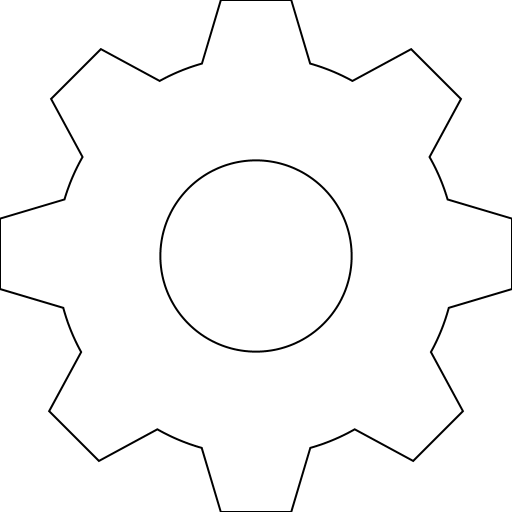

```yaml
Shoot:
  Trigger: <TriggerSerializer>
  Projectile_Speed: <speed>
  Projectiles_Per_Shot: <amount>
  Selective_Fire:
    Trigger: <TriggerSerializer>
    Mechanics: <MechanicsSerializer>
  Delay_Between_Shots: <ticks>
  Fully_Automatic_Shots_Per_Second: <amount>
  Burst:
    Shots_Per_Burst: <amount>
    Ticks_Between_Each_Shot: <ticks>
  Spread: <SpreadSerializer> # Scroll down for more information
  Recoil: <RecoilSerializer> # Scroll down for more information
  Mechanics: <MechanicsSerializer>
```
#### `Trigger`: \<Trigger\>
This is the trigger used to actually shoot the gun. See [the wiki for trigger](General.md#trigger).

#### `Projectile_Speed`: \<Double\>
This is how fast your projectile moves when it is shot. Note that `Projectile_Speed: 10` is 
very slow, because the projectile will move 1 block every tick. You probably
don't want to use a projectile speed over 200.

You can calculate velocity in meters per second by multiplying this number by 2.

**Developers**: This value is divided by 10.0 when serialized.

#### `Projectiles_Per_Shot`: \<Integer\>
How many projectiles should be spawned for every shot? This is mainly for shotguns.

#### `Selective_Fire`:
Select fire is simple implementation to allow choosing between `SINGLE`, `BURST` and `AUTO` fire modes.

First fire mode is always `SINGLE` when weapon is received.

The order of changing fire modes is `1. SINGLE`, `2. BURST`, `3. AUTO`. 
The order can also be just `1. SINGLE`, `2. AUTO` if `BURST` isn't enabled for this weapon.

Selective fire current state can be shown [weapon info display](Information.md#weapon_info_display),
and their symbols can be changed in file `WeaponMechanics/config.yml` at the `Placeholder_Symbols` section.

* `Trigger`: \<Trigger\>
  * The trigger which changes fire mode to next one
* `Mechanics`: \<Mechanics\>
  * See [the wiki for mechanics](General.md#mechanics)

#### `Delay_Between_Shots`: \<Integer\>
If your gun is in standard or burst mode, this is the time in ticks (20 ticks = 1 second) between being able
to fire your gun.

Note, if you are holding right click, this may be inaccurate by 1 tick (Due to how minecraft 
handles holding right click). This also means it is faster to spam right click then to hold 
right click. 

**Developers**: This value is multiplied by 50 during serialization because it is stored as milliseconds.

#### `Fully_Automatic_Shots_Per_Second`: \<Integer\>
This makes your weapon a fully automatic weapon. It is recommended to use values [1, 20], but you can use larger
numbers if you want (This will make it look like your gun is firing multiple projectiles at once due to limitations
in minecraft). I suggest using one of the following: `1`, `2`, `4`, `5`, `10`, `15`, `20`.

#### `Burst`:
These options make your gun a burst gun. This is useful for firing a few bullets in rapid succession
while only shooting the gun once.

* `Shots_Per_Burst`: \<Integer\>
  * How many bullets are actually fired.
  * This number should be higher than 1.
    * If you are using burst, what is the point of shooting 1 projectile?
* `Ticks_Between_Each_Shot`: \<Integer\>
  * The amount of time, in ticks, between each bullet.
  * For most use cases, this number should be less then 20.
  * 20 ticks = 1 second.
  
## Spread:
Spread is used to define how "random" a bullet's path is. You obviously don't want a bullet to fly perfectly
straight every time! You can replicate video games by making guns less accurate if the player is moving or jumping, 
or you could define exact spread shapes by using images.

**REMEMBER**: Spread and accuracy are 2 different concepts, and are inversely related. This
means that if your gun has a *high* spread, it will have a *low* accuracy.

```yaml
Spread:
  Spread_Image:
    Name: <path>
    Field_Of_View_Width: <degrees> 
    Field_Of_View_Height: <degrees> 
  Base_Spread: <base spread>
  Modify_Spread_When:
    Zooming: <amount> or <amount>%
    Sneaking: <amount> or <amount>%
    Standing: <amount> or <amount>%
    Walking: <amount> or <amount>%
    Swimming: <amount> or <amount>%
    In_Midair: <amount> or <amount>%
    Gliding: <amount> or <amount>%
  Changing_Spread:
    Starting_Amount: <amount>
    Increase_Change_When:
      Always: <amount> or <amount>%
      Zooming: <amount> or <amount>%
      Sneaking: <amount> or <amount>%
      Standing: <amount> or <amount>%
      Walking: <amount> or <amount>%
      Swimming: <amount> or <amount>%
      In_Midair: <amount> or <amount>%
      Gliding: <amount> or <amount>%
    Bounds:
      Reset_After_Reaching_Bound: <true/false>
      Minimum_Spread: <minimum spread>
      Maximum_Spread: <maximum spread>
```

#### `Spread_Image`: 
Spread images are `.png` files located in `server > plugins > WeaponMechanics > spread_patterns`. If you
use this, *you cannot use other spread features*.

* `Name`: \<String\>
  * The name of the image
  * You do not need to add `.png` to the end
* `Field_Of_View_Width`: \<Double\> 
  * How wide the image should be translated to spread
  * This is a bit confusing, but basically the edge of your image will use this value
  * Try playing around with numbers like `22.5`, `45`, and `90`
  * Defaults to `45`
* `Field_Of_View_Height`: \<Double\>
  * How wide the image should be translated to spread
  * This is a bit confusing, but basically the edge of your image will use this value
  * Try playing around with numbers like `22.5`, `45`, and `90`
  * Defaults to `45`

You can draw your own spread patterns using a program like paint, paint.net or photoshop. To
make a spread image, use dark blacks to define where bullets will shoot. You can use a
gradient of grays to change how often a bullet will be shot from a certain pixel. I personally
recommend you keep images smaller than 64x64 to save on RAM usage, though there should not be 
any impact to CPU usage. Make sure you are not using colors in the image!

Here is a `512 x 512` example of a gear:



#### `Base_Spread`: \<Double\>
This is the randomness applied vertically and horizontally.

#### `Modify_Spread_When`: 
This modifies the amount from `Base_Spread`. You can use set amounts, or percentages.
When using set amounts, the number is added to the base spread. For example, if
`Base_Spread: 0.5` and `Zooming: -0.3`, your spread while zooming will be `0.5 + -0.3 = 0.2`.
When using percentages, the formula is `Spread = BaseSpread * Zooming / 100`. For 
example, if `Base_Spread: 1.0` and `Zooming: 25%`, `1.0 * 25 / 100 = 0.25`.

* `Zooming`: \<Double\> 
  * When the shooter is currently scoping/zooming with their weapon.
* `Sneaking`: \<Double\>
  * When the player is sneaking/crouching (`shift` key).
* `Standing`: \<Double\>
  * When not doing any of these others.
* `Walking`: \<Double\> 
  * When the shooter is moving.
* `Swimming`: \<Double\> 
  * When the shooter is in water (Not 1.13+ player swimming, just if they are in water).
* `In_Midair`: \<Double\> 
  * When the shooter is in the air (Not on the ground).
* `Gliding`: \<Double\> 
  * When the player is gliding (Using an elytra).

Note:
* If your spread goes below 0 (e.x. `0.7 - 0.5 - 0.4 = -0.2`), it will automatically round up to 0.

Example:
```yaml
Modify_Spread_When:
  Zooming: -0.5    # Make the gun more accurate when scoping
  Sneaking: -0.2
  Standing: 0.0
  Walking: 0.15
  Swimming: 0.15
  In_Midair: 0.4   # Player is probably jumping, so make them inaccurate
  Gliding: 0.6     # Player is probably moving super quick, so make them inaccurate
```

#### `Changing_Spread`:
This changes the spread after each shot. This is generally used for guns that get less accurate the more
you fire it. Many online shooters use this (Sometimes very subtly). This is very commonly used in automatic 
guns that are being sprayed.

* `Starting_Amount`: \<Double\>
  * The changing spread start amount.
  * Basically if this is `0` there won't be any spread change in the first shot.
* `Increase_Change_When`:
  * This works just like [Modify_Spread_When](#modify_spread_when) (You can use the percentages).
  * Personally, I think you should only use the `Always` option. You can use the others if you want.
  * `Always`: \<Double\>
    * Every shot.
  * `Zooming`: \<Double\> 
    * When the shooter is currently scoping/zooming with their weapon.
  * `Sneaking`: \<Double\>
    * When the player is sneaking/crouching (`shift` key).
  * `Standing`: \<Double\>
    * When not doing any of these others.
  * `Walking`: \<Double\> 
    * When the shooter is moving.
  * `Swimming`: \<Double\> 
    * When the shooter is in water (Not 1.13+ player swimming, just if they are in water).
  * `In_Midair`: \<Double\> 
    * When the shooter is in mid air (Not on the ground).
  * `Gliding`: \<Double\> 
    * When the player is gliding (Using an elytra).
* `Bounds`:
  * These are the maximum and minimum values for **changing** spread. (CHANGING spread value will always stay within those bounds)
  * `Reset_After_Reach_Bounds`: \<Boolean\>
    * Use `true` to reset the spread back to `Base_Spread + Starting_Amount`. Otherwise use `false`.
    * Most people will want to use `false` so the spread stays high if people are spraying.
  * `Minimum_Spread`: \<Double\>
    * The lowest changing spread value allowed
  * `Maximum_Spread`: \<Double\>
    * The highest changing spread value allowed

Spread is a very important concept for a server. If defines how people use their guns in their
environment. Some First-Person-Shooters (FPS) don't use spread, and instead rely on a gun's 
[Recoil](#Recoil). Some FPS will use only spread, or a combination of spread and recoil. There
is no "right" way to do this, but you should make sure that all of your guns are built off of
the same concept.

## Recoil
Recoil moves the player's screen horizontally and/or vertically, then "recovers" back
to the position the player was looking.

```yaml
Recoil:
  Push_Time: <push time in millis>
  Recover_Time: <recover time in millis>
  Horizontal:
    - <horizontal recoil>
    - <etc.>
  Vertical:
    - <vertical recoil>
    - <etc.>
  Recoil_Pattern:
    Repeat_Pattern: <true/false>
    List:
      - <horizontal recoil>-<vertical recoil>-<chance to skip>%
      - <etc.>
```
#### `Push_Time`: \<Integer\>
The time in **milliseconds** it takes to reach the full recoil amount.
`50` milliseconds is equal to `1` server tick and equal to `0.05` seconds.
Use `0` to instantly push to full recoil amount.

#### `Recover_Time`: \<Integer\>
The time in **milliseconds** it takes to recover back to normal after full recoil amount is reached.
Note that after push there is also `60` milliseconds cooldown before starting recovery to make it more smooth.
`50` milliseconds is equal to `1` server tick and equal to `0.05` seconds.
Use `0` to instantly recover to normal.

#### `Horizontal`: \<Double list\>
The list of possible horizontal changes per shot. WeaponMechanics takes one of these randomly
from this list on each shot and uses it. If you don't want horizontal recoil, then simply don't use this.

Notes:
* Negative value means left, and positive right.
* Horizontal means yaw, values like `5`, `-4`, `10` are recommended.

#### `Vertical`: \<Double list\>
The list of possible vertical changes per shot. WeaponMechanics takes one of these randomly
from this list on each shot and uses it. If you don't want vertical recoil, then simply don't use this.

Notes:
* Negative value means down, and positive up.
* Vertical means pitch, values like `5`, `-4`, `10` are recommended.

#### `Recoil_Pattern`:

* `Repeat_Pattern`: \<Boolean\>
  * Whether the recoil pattern should start again after reaching its end.
  * `True` = when `List` has reached its end, recoil pattern will start again.
  * `False` = when `List` has reached its end, there won't be recoil until push and recovery
  have finished and new shot is made.
* `List`: \<String list\>
  * `<horizontal recoil>`: First arg means horizontal recoil and it works like said [above](#horizontal-double-list)
  * `<vertical recoil>`: Second arg means vertical recoil and it also works like said [above](#vertical-double-list)
  * `<chance to skip>`: Third arg means the chance to skip this from recoil pattern.
    Value has to be between `0` and `100`. This arg is optional.

## Mechanics

See [the wiki for mechanics](General.md#mechanics)